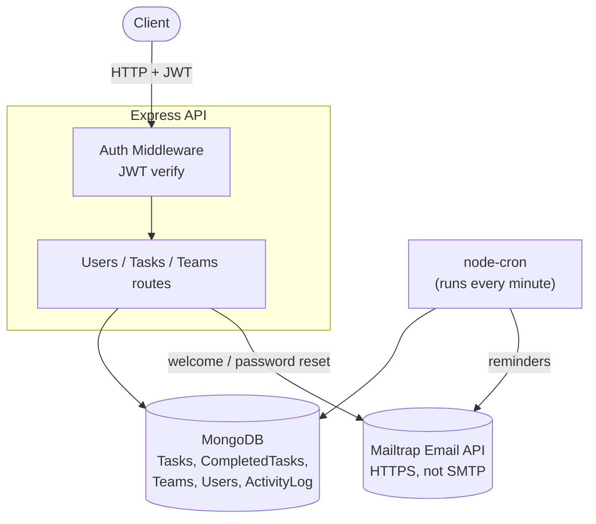
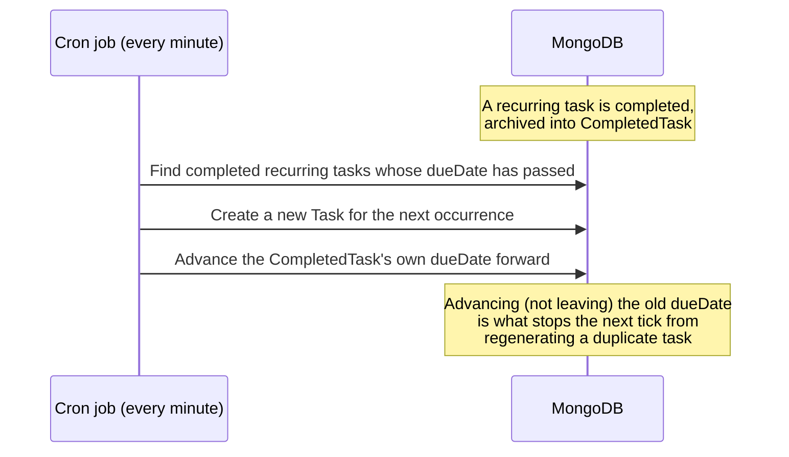

# Smart Task Manager (Backend)

A backend for a task management app with recurring tasks, cron-driven email reminders, and team collaboration. Originally built as a full-stack project (a React frontend lives alongside this backend in the same codebase); this README, and the resume entry it supports, covers the **backend specifically** — the frontend is a separate personal project, not part of this pitch.

**Live API:** https://smart-task-manager-nq9l.onrender.com
*(hosted on Render's free tier — the first request after a period of inactivity may take 30-60s to wake up)*

[](https://github.com/neterosaan/Smart-Task-Manager/actions/workflows/tests.yml)

---

## What this project demonstrates

- **Recurring task generation** — a task marked to recur daily/weekly/monthly automatically produces its next occurrence once completed, computed via `date-fns` against the original due date, not just "N days from now" (which would drift).
- **An archive-on-complete data model** — completing a task moves it out of the active `Task` collection into a separate `CompletedTask` collection (logged to an activity feed in the process), keeping the active-task queries fast and the completed-task history intact and queryable separately.
- **A scheduled, cron-driven reminder and recurrence system** — a background job (`node-cron`) checks for due reminders and expired recurring tasks every minute, sending email notifications and regenerating recurring tasks without duplicating them.
- **Team collaboration with per-member progress tracking** — a team task isn't a single shared "done/not done" flag; each member gets their own `TaskProgress` record, so a shared task's completion is tracked independently per person.
- **A genuine automated test suite** built specifically to lock in real bugs found during development — including a full concurrency-safe authorization pass over three separate access-control gaps (see below).

---

## Architecture



### Recurring task lifecycle



---

## Tech stack

- **Runtime:** Node.js 22, Express 4
- **Database:** MongoDB via Mongoose
- **Auth:** Self-issued JWTs (access + httpOnly refresh token cookie), bcrypt password hashing, hashed password-reset tokens
- **Scheduled jobs:** node-cron
- **Email:** Mailtrap's HTTP Email API (not SMTP — see [Notable bugs](#notable-bugs-found--fixed-during-development) below for why)
- **Security:** helmet, express-rate-limit
- **Testing:** Vitest, with a real disposable MongoDB container for integration tests
- **CI:** GitHub Actions — runs the full suite against a real MongoDB service container on every push
- **Docs:** Swagger/OpenAPI

---

## Features

| Feature | Notes |
|---|---|
| Auth | Register/login/refresh/logout, forgot/reset password (hashed reset tokens) |
| Tasks | Create, update, delete, list — scoped strictly to the authenticated user |
| Recurring tasks | Daily/weekly/monthly recurrence, auto-regenerated on completion |
| Task archiving | Completing a task moves it to a separate `CompletedTask` collection with an activity log entry |
| Teams | Create a team, invite members by username, accept/decline invitations |
| Team tasks | Owner-created shared tasks with independent per-member completion tracking |
| Reminders | Scheduled email reminders for upcoming due dates |

---

## API reference

- **REST collection:** [`Smart-Task-Manager.postman_collection.json`](./Smart-Task-Manager.postman_collection.json)
- **Interactive API docs (Swagger UI):** https://smart-task-manager-nq9l.onrender.com/api-docs

---

## Running locally

**Requirements:** Node 22+, Docker (for the test database), a MongoDB instance (local or Atlas), a Mailtrap account (Email Testing/sandbox is sufficient for local dev).

```bash
git clone https://github.com/neterosaan/Smart-Task-Manager.git
cd Smart-Task-Manager
npm install
```

Create a `config.env` file:
```
NODE_ENV=development
PORT=5000
MONGO_URI=<your MongoDB connection string>
JWT_SECRET=<a long random string>
JWT_EXPIRES_IN=15m
REFRESH_TOKEN_EXPIRES_IN_DAYS=30
FRONTEND_URL=http://localhost:5173
EMAIL_FROM=<your sender address>
MAILTRAP_API_TOKEN=<your Mailtrap API token>
MAILTRAP_INBOX_ID=<your Mailtrap sandbox inbox ID>
```

```bash
npm start
```

### Running the tests

```bash
npm run test:db:up       # starts a disposable MongoDB container
npm test
```

---

## Notable bugs found & fixed during development

- **Two task endpoints (`updateTask`, `deleteTask`) had no ownership check at all** — any authenticated user could update or delete *any other user's* task by ID (an IDOR vulnerability). Fixed by scoping both queries to the authenticated user, matching the pattern already correct in `getTask`, and locked in with a dedicated regression test suite.
- **`sendInvite` had no check that the requester actually owned the team** — any authenticated user could invite anyone to any team in the system, regardless of their own relationship to it.
- **The team owner could never see their own team's tasks.** Team creation never added the owner to the team's `members` list, but `getTasksForTeam`/`getTaskForTeam` checked membership via that same list — so the one person allowed to create team tasks couldn't retrieve them afterward. Fixed by including the owner in per-member progress tracking, matching every other member.
- **A recurring task could duplicate indefinitely.** The cron job that regenerates a completed recurring task's next occurrence never advanced the original completed task's own due date — so on the next tick, it would still look "due," and get regenerated again, forever. Fixed by advancing the completed task's due date forward once its next occurrence is created.
- **Render's free tier silently blocks outbound SMTP traffic** (ports 25, 465, 587) to prevent spam abuse — meaning `nodemailer`-based email sending, which worked perfectly locally, failed immediately once deployed, with no code-level indication of why. Fixed by switching email sending from SMTP to Mailtrap's HTTP-based Email API, which works over standard HTTPS and isn't subject to the same port restriction.
- **Dead, structurally broken role-restriction middleware** (`restrictTo`) existed but was never used by any route, and referenced a `role` field that doesn't exist anywhere on the `User` schema — meaning it could never have worked even if it had been wired in. Removed rather than left as a trap for a future "just add this to a route" assumption.
- **A missing `errorController.js` environment check** meant any environment other than exactly `'development'` or `'production'` (including `'test'`) silently received no error response at all — a request would simply hang until timeout. Fixed to treat any non-development environment the same, safe way.

---

## Known limitations

- Mailtrap is currently in sandbox/testing mode — emails are captured in a private testing inbox rather than delivered to real recipients. This is a deliberate choice for a portfolio project (avoids needing to purchase and verify a sending domain) rather than a bug; switching to real delivery would only require a Mailtrap sending-domain upgrade, no code changes.
- No horizontal scaling consideration for the cron job — running multiple instances of this service would cause the scheduled reminder/recurrence checks to run redundantly on each instance. Not a concern at the current single-instance deployment scale.
